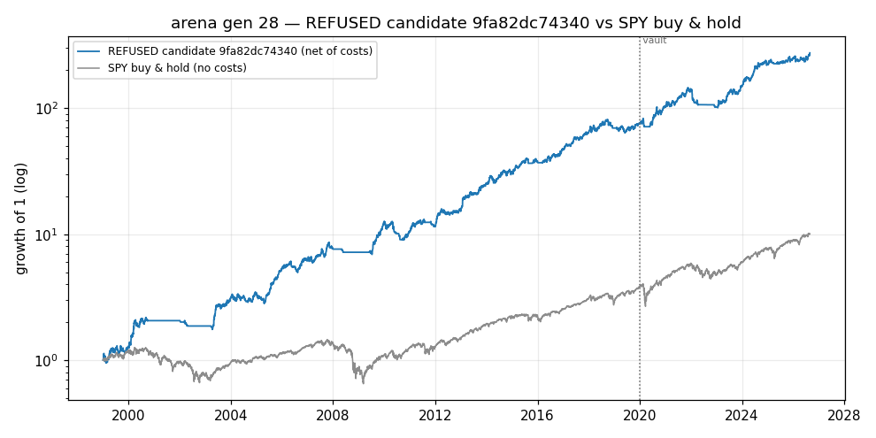
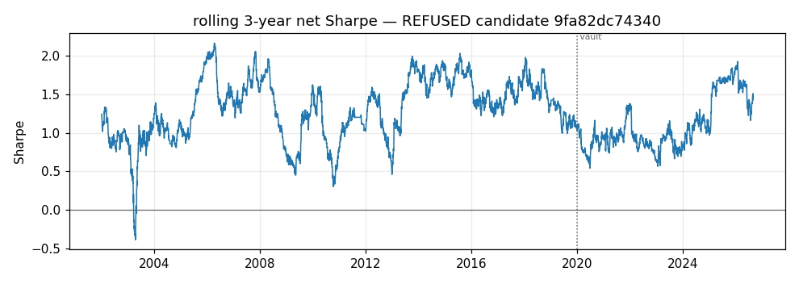
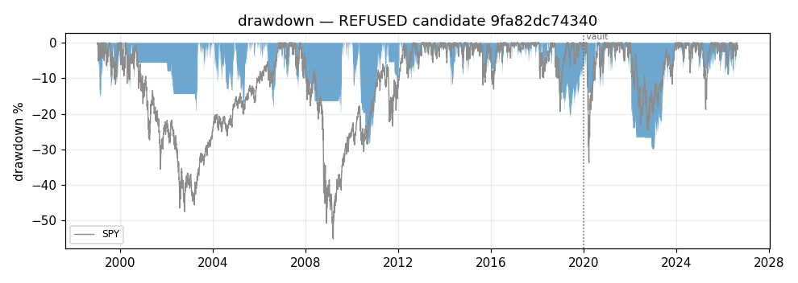

# arena — generation 28

**No champion.** Nothing has passed all ten promotion gates, so this system currently recommends nothing and holds nothing.

This report is about `9fa82dc74340`, the leading candidate of the last deep evaluation, **which the gates REFUSED** (failed G2+G4+G10). It is shown because a refusal with its numbers attached is more useful than a blank page — not because it is close to being a champion.

| | |
|---|---|
| data as of | 2026-08-28 |
| evaluation window | 1998-12-30 .. 2019-12-31 |
| vault window | 2020-01-02 .. 2026-08-28 |
| identity | data `cd9e0258afdb6e0b` · panel `b10d592e8cd8d916` · config `08e08b3bdbf78812` |
| platform | x86_64linux (vendored siblings) |
| family | seasonal_rule |

## Equity, rolling Sharpe, drawdown

*Net equity against SPY buy-and-hold. The strategy line is net of every modelled friction; the benchmark line is not, which flatters the benchmark and is the harder comparison to win.*

*Rolling 3-year net Sharpe. Flat stretches below zero are what a single headline Sharpe hides.*

*Drawdown from the running peak, strategy and benchmark.*

*Everything left of the dotted vault line was available to selection; everything right of it was touched only by the promotion gates.*

## Headline numbers

| statistic | value |
|---|---|
| pre-vault net Sharpe | +1.285 |
| pre-vault days scored | 5285 |
| vault net Sharpe | +1.190 |
| vault days | 1673 |
| Sharpe at 2x costs | +1.207 |
| bootstrap 95% CI of net Sharpe | [+0.809, +1.745] |
| CPCV paths net-positive | 100% of 28 (median path SR +1.22) |
| P(drawdown > 40% in 2 years) | 0.125 |

### Deflated Sharpe and PBO

- **DSR 0.0048 at N = 246 ledger trials, 5 vault trials** (sr0 threshold 0.1165, T = 5285 days, skew 0.213, kurtosis 7.331). The deflation uses the EMPIRICAL spread of trial Sharpes from the ledger, never a hardcoded count.
- Vault DSR **0.9895** at N = 5 vault trials — the count of times any candidate has been shown the post-2020-01-01 data at all.
- **PBO 0.289** (CSCV, cohort of 6 genomes, 12870 splits) — computed over the returns matrix of generation 28, the cohort this record belongs to.
- DSR is an OPTIMISTIC correction here: evolutionary trials are correlated, and correlated trials deflate less than independent ones would. The vault and the paper stage sit above it for exactly that reason.

## The ten promotion gates

| gate | what it asks | value | threshold | |
|---|---|---|---|---|
| G1 | like-for-like | cd9e0258afdb6e0b / b10d592e8cd8d916 / 08e08b3bdbf78812 | complete identity | PASS |
| G2 | DSR (pre-vault) | 0.005 | 0.950 | **FAIL** |
| G3 | vault confirmation | 1.190 / 0.990 | 0.000 / 0.900 | PASS |
| G4 | PBO (CSCV) | 0.289 | 0.200 | **FAIL** |
| G5 | CPCV 28 paths | 1.000 / 1.215 | 0.700 / 0.300 | PASS |
| G6 | bootstrap Sharpe CI | 0.809 | 0.000 | PASS |
| G7 | 2x cost stress | 1.207 / 0.939 | 0.000 / 0.500 | PASS |
| G8 | regime slices | -0.275 / 3 | -0.300 / 3 | PASS |
| G9 | beats incumbent | n/a | 0.000 | PASS |
| G10 | ruin MC | 0.125 | 0.050 | **FAIL** |

Deep-eval history row: promoted=0, candidates evaluated=2, gates failed=G2+G4+G10, complete=1.

*All ten must pass; ties go to the incumbent. A single failure is a refusal, and a refusal is the system working.*

## Crisis regimes (gate G8)

| window | net return | days | |
|---|---:|---:|---|
| 2000-03-01 .. 2002-10-31 | +14.5% | 671 |  |
| 2008-09-01 .. 2009-03-31 | +0.0% | 146 |  |
| 2020-01-01 .. 2020-06-30 | +2.0% | 125 |  |
| 2022-01-01 .. 2022-12-31 | -27.5% | 251 | under the soft floor (-5%) |

*Windows are drawdown LEGS — peak to trough, not peak to recovery. A window containing the rebound measures the wrong thing: 2008-01..2009-12 comes out positive for a book that was destroyed in the autumn of 2008.*

## Costs

- Gross cumulative return **+9770.7%**, net **+7452.9%** over 5285 pre-vault days.
- Cost drag **128 bps/year** of equity; mean daily turnover **8.6%** of equity.
- Total frictions paid: **$185,831** on a $15,000 account.
- **Cost share of gross: 5.5%**

## Trial ledger

- **246 distinct genomes** have been evaluated at some fidelity and are on the ledger. That is the N every deflated Sharpe above is deflated by.
- **6 vault accesses** logged. Every look at post-2020-01-01 data is counted, including the ones that only stored an artifact.
- Screens count as trials. They exert selection pressure, so excluding them would make every DSR on this page optimistic.

## Hall of fame (top 10, pre-vault and ungated)

| # | genome | family | pre-vault SR | gen | born | op | parent |
|---|--------|--------|-------------:|----:|-----:|----|--------|
| 1 | `9fa82dc74340` | seasonal_rule | +1.285 | 28 | 26 | elite | `4b899e1cb71e` |
| 2 | `c17f77b7d09d` | seasonal_rule | +1.285 | 28 | 28 | mutate | `14574361d767` |
| 3 | `f6534cfed801` | seasonal_rule | +1.262 | 23 | 23 | crossover | `4b899e1cb71e` x `4b899e1cb71e` |
| 4 | `ee97a2e76cf9` | seasonal_rule | +1.262 | 24 | 24 | mutate | `4b899e1cb71e` |
| 5 | `a0a007afe3f1` | seasonal_rule | +1.262 | 27 | 16 | elite | `487279b1d7ad` |
| 6 | `cf1555a3b1c0` | seasonal_rule | +1.262 | 27 | 27 | crossover | `cf1555a3b1c0` x `4b899e1cb71e` |
| 7 | `14574361d767` | seasonal_rule | +1.262 | 28 | 27 | elite | `4b899e1cb71e` |
| 8 | `4b899e1cb71e` | seasonal_rule | +1.262 | 28 | 20 | elite | `a0a007afe3f1` x `a0a007afe3f1` |
| 9 | `d7c97feb632a` | seasonal_rule | +1.237 | 21 | 19 | elite | `a0a007afe3f1` |
| 10 | `487279b1d7ad` | seasonal_rule | +1.233 | 19 | 9 | elite | `19389d18f6e0` |

*Lineage columns are how a genome got here: which operator made it, from which parent, in which generation.*

## Simulation vs paper trading

**Paper trading has not started.** The graduation rule is three consecutive weekly deep evals kept by the same champion (docs/DESIGN.md, "Graduation ladder"); there is no champion at all. Until then every number in this report is a simulation of the past, and the sim-vs-realised overlay this section will hold does not exist.

---

## Limitations — read these with every number above

- **Survivorship bias.** The universe is a snapshot of today's index membership,
  so every company that failed out of it is absent from all of these backtests:
  long results come out optimistic and short results pessimistic. Disclosed, not
  solved; delisted-inclusive (CRSP-class) data is the named upgrade path.
- **Non-stationarity.** 1990s microstructure is simulated with modern costs, and
  a decades-old edge may simply have been arbitraged away since. The vault, the
  regime gate and the paper stage are defenses, not proofs.
- **Multiple testing survives the gates.** Evolutionary trials are correlated, so
  the ledger DSR under-deflates; PBO does not cover designer-level choices at all.
  The only accumulating true out-of-sample is vault -> paper -> live.
- **Small-account sensitivity.** The $1 minimum commission and whole-share
  rounding are 5-10 bps each way on small positions; the 2x cost-stress gate and
  the cost-share line above are what keep that visible.
- **The cost model is proportional (bps), not per-share.** Prices are
  split-adjusted, so a $/share friction would silently become hundreds of bps on
  1990s adjusted prices. Real 1990s spreads were wider than modern bps: any edge
  that survives only at modern costs is suspect by construction.

**Survivorship: the universe is today's S&P 500 membership, so long results flatter and short results understate.**

**Backtest alpha is a claim about the past, not a guarantee — not financial advice.**
